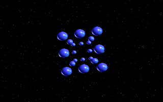
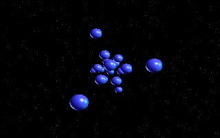
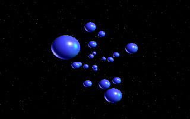
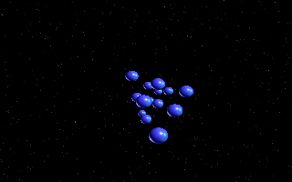

# Vector Balls - 386/486 Graphics Demo

A 386/486 demo featuring 3D vector balls, keyframe animation, a starfield, and palette-controlled fade effects.

Written in C for DOS Mode 13h (320x200, 256-color VGA). Compiled with Borland Turbo C++ 3.1, targeting a 486 with no FPU co-processor.

|||
|---|---|
|||
|||

## Features

- Vector ball sprites with 3D rotation and perspective projection.
- Smooth keyframe morphing transitions.
- 3D scrolling starfield (4000 stars).
- Palette-controlled fade-in and fade-out.
- Z-ordered back-to-front rendering with distance-scaled sprites.
- Double-buffered display with VSync synchronization.
- Interrupt 09h keyboard handler.

## Running the Demo

The pre-compiled `BALLS.EXE` is included in the [Releases](../../releases) section. It is a 16-bit DOS executable and requires a DOS or DOS emulated environment to run. It has been tested in DOSBox.

### Using DOSBox

1. Install [DOSBox](https://www.dosbox.com/) or [DOSBox-X](https://dosbox-x.com/).
2. Download `BALLS.EXE` and `sprites.dat` from the latest release and place them in the same folder.
3. Launch DOSBox and mount the folder:
   ```
   mount c c:\path\to\your\folder
   c:
   ```
4. Run the demo:
   ```
   balls
   ```
5. Press **ESC** to exit (the screen will fade out before returning to DOS).


### Using DOSBox-X or 86Box

Any DOS-compatible emulator that supports Mode 13h VGA graphics will work. Mount the directory containing `BALLS.EXE` and `sprites.dat`, then run `BALLS`. `sprites.dat` needs to be in the same folder as `BALLS.EXE`.

## Building from Source

Building requires **Borland Turbo C++ 3.1** (`BCC.EXE`) running inside DOSBox. The compiler is a 16-bit DOS program and cannot run on a modern OS directly.

### Prerequisites

- [DOSBox](https://www.dosbox.com/) (or DOSBox-X)
- Borland Turbo C++ 3.1 installed and accessible from within DOSBox

### Build Steps

1. Mount both the Borland compiler directory and the project source directory in DOSBox.
2. Ensure `BCC.EXE` is on the DOS `PATH`.
3. Navigate to the source directory and run the build script:
   ```
   build
   ```
   This executes:
   ```
   BCC -ml -1 main.c gfx13.c starfld.c vecballs.c
   ```
   and renames the output to `BALLS.EXE`.

### Compiler Flags

| Flag  | Purpose                                                                 |
|-------|-------------------------------------------------------------------------|
| `-ml` | Large memory model (required for far pointers and 64 KB+ buffers)       |
| `-1`  | Enable 80186+ instructions (required for `OUTSB` in inline assembly)    |

### Build Notes

- All source filenames follow the DOS 8.3 naming convention.
- BCC compiles `.c` files as C, not C++. The `-P` flag (C++ mode) is not used.
- `clean.bat` removes build artifacts (`.OBJ` files and `BUILD.LOG`).

## Project Structure

```
balls/
  main.c        Entry point, keyboard interrupt handler, palette control
  gfx13.h       Mode 13h graphics library. Type definitions and prototypes
  gfx13.c       Mode 13h graphics library. Drawing, blitting, palette, VSync
  graphics.h    Shared demo header. Includes gfx13.h, globals, prototypes
  starfld.c     3D starfield initialization and rendering
  vecballs.c    Ball sprites, keyframe morphing, 3D transform, animation loop
  sprites.dat   Binary sprite data (36 ball frames with metadata)
  build.bat     Build script for BCC
  clean.bat     Removes build artifacts
  BALLS.EXE     Pre-compiled DOS executable
```

## Technical Details

### Rendering Pipeline

All graphics go through a Mode 13h (VGA 320x200, 256 colors) rendering pipeline implemented in `gfx13.c`:

- Direct VGA register programming via inline assembly
- Off-screen 64 KB buffer (`screen_buffer_320x200`) for double buffering
- `FlipScreen()` copies the buffer to VGA memory at `0xA000:0000`
- `WaitRetrace()` synchronizes with the vertical blank interval

### 3D Animation

The main animation loop in `vecballs.c` performs:

1. **Rotation** - 3-axis rotation (X, Y, Z) using a precomputed sine lookup table.
2. **Projection** - Perspective division maps 3D coordinates to screen space.
3. **Sprite Selection** - Distance determines which of the 36 size-scaled ball sprites to draw.
4. **Z-Ordering** - A distance queue renders balls back-to-front for correct occlusion.
5. **Morphing** - Smooth interpolation between 13 predefined ball formations across 18 morph sequences.

### Target Hardware

- CPU: Intel 306 or 486 (no FPU required, all math is fixed-point integer)
- Video: VGA-compatible (Mode 13h)
- Memory: Conventional DOS memory (large model)

## License

This project is shared for educational and archival purposes.
