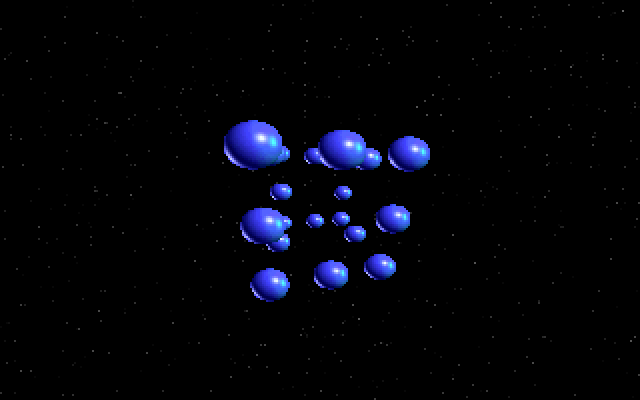

# Vector Balls - 386/486 Graphics Demo


<p align="center">
  
</p>

A 386/486 demo featuring 3D vector balls, keyframe animation, a starfield, and palette-controlled fade effects. Should work on a 386 as well. 

Written in C for DOS Mode 13h (320x200, 256-color VGA). Compiled with Borland Turbo C++ 3.1, targeting a 486 with no FPU co-processor.

## 📑 Table of Contents

- [✨ Features](#-features)
- [🎮 Running the Demo](#-running-the-demo)
- [🔨 Building from Source](#-building-from-source)
- [📁 Project Structure](#-project-structure)
- [🛠️ Technical Details](#-technical-details)
- [📄 License](#-license)

## ✨ Features

- Vector ball sprites with 3D rotation and perspective projection.
- Smooth keyframe morphing transitions.
- 3D scrolling starfield (4000 stars).
- Palette-controlled fade-in and fade-out.
- Z-ordered back-to-front rendering with distance-scaled sprites.
- Double-buffered display with VSync synchronization.
- Interrupt 09h keyboard handler.

## 🎮 Running the Demo

The pre-compiled `BALLS.EXE` is included in the [Releases](../../releases) section. It is a 16-bit DOS executable and requires a DOS or DOS emulated environment to run. It has been tested in DOSBox.

### Using DOSBox

1. Install [DOSBox](https://www.dosbox.com/) or [DOSBox-X](https://dosbox-x.com/).
2. Download `BALLS.EXE` and `sprites.dat` from the latest release and place them in the same folder.
3. Launch DOSBox and mount the folder:
   ```
   mount c c:\path\to\your\folder
   c:
   ```
4. Run the demo:
   ```
   balls
   ```
5. Press **ESC** to exit (the screen will fade out before returning to DOS).


### Using DOSBox-X or 86Box

Any DOS-compatible emulator that supports Mode 13h VGA graphics will work. Mount the directory containing `BALLS.EXE` and `sprites.dat`, then run `BALLS`. `sprites.dat` needs to be in the same folder as `BALLS.EXE`.

## 🔨 Building from Source

Building requires **Borland Turbo C++ 3.1** (`BCC.EXE`) and **Borland Turbo Assembler** (`TASM.EXE`) running inside DOSBox. Both are 16-bit DOS programs and cannot run on a modern OS directly.

### Prerequisites

- [DOSBox](https://www.dosbox.com/) (or DOSBox-X)
- Borland Turbo C++ 3.1 (`BCC.EXE`) and Borland Turbo Assembler (`TASM.EXE`) installed and accessible from within DOSBox

### Build Steps

1. Mount both the Borland compiler directory and the project source directory in DOSBox.
2. Ensure `BCC.EXE` and `TASM.EXE` are on the DOS `PATH`.
3. Navigate to the `src` directory and run the build script:
   ```
   build
   ```
   This assembles the graphics library and compiles the C sources:
   ```
   TASM /ml gfx13.asm,gfx13.obj
   BCC -ml -1 main.c starfld.c vecballs.c gfx13.obj
   ```
   and renames the output to `BALLS.EXE`. Everything builds in place inside `src`, alongside `sprites.dat` (which the demo loads at runtime), so you can build and run the demo from the same directory.

### Compiler Flags

| Flag  | Purpose                                                                 |
|-------|-------------------------------------------------------------------------|
| `-ml` | Large memory model (required for far pointers and 64 KB+ buffers)       |
| `-1`  | Enable 80186+ instructions (required for `OUTSB` in inline assembly)    |

### Build Notes

- All source filenames follow the DOS 8.3 naming convention.
- BCC compiles `.c` files as C, not C++. The `-P` flag (C++ mode) is not used.
- `clean.bat` removes build artifacts (`.OBJ` files and `BUILD.LOG`).

## 📁 Project Structure

```
balls
├─ src               Self-contained: source, build scripts, data, and executable
│  ├─ main.c         Entry point, keyboard interrupt handler, palette control
│  ├─ gfx13.h        Mode 13h graphics library. Type definitions and prototypes
│  ├─ gfx13.asm      Mode 13h graphics library (TASM). Drawing, blitting, palette, VSync
│  ├─ graphics.h     Shared demo header. Includes gfx13.h, globals, prototypes
│  ├─ starfld.c      3D starfield initialization and rendering
│  ├─ vecballs.c     Ball sprites, keyframe morphing, 3D transform, animation loop
│  ├─ sprites.dat    Binary sprite data (36 ball frames with metadata)
│  ├─ build.bat      Build script (assembles + compiles, outputs BALLS.EXE)
│  ├─ clean.bat      Removes build artifacts
│  └─ BALLS.EXE      Pre-compiled DOS executable (build + run here)
│
├─ README.md         This file
│
├─ LICENSE           MIT License
│
└─ images
   └─ capture        Screenshots and animated capture
```

## 🛠️ Technical Details

### Rendering Pipeline

All graphics go through a Mode 13h (VGA 320x200, 256 colors) rendering pipeline implemented in `gfx13.asm`:

- Direct VGA register programming via inline assembly
- Off-screen 64 KB buffer (`screen_buffer_320x200`) for double buffering
- `FlipScreen()` copies the buffer to VGA memory at `0xA000:0000`
- `WaitRetrace()` synchronizes with the vertical blank interval

### 3D Animation

The main animation loop in `vecballs.c` performs:

1. **Rotation** - 3-axis rotation (X, Y, Z) using a precomputed sine lookup table.
2. **Projection** - Perspective division maps 3D coordinates to screen space.
3. **Sprite Selection** - Distance determines which of the 36 size-scaled ball sprites to draw.
4. **Z-Ordering** - A distance queue renders balls back-to-front for correct occlusion.
5. **Morphing** - Smooth interpolation between 13 predefined ball formations across 18 morph sequences.

### Target Hardware

- CPU: Intel 386 or 486 (no FPU required, all math is fixed-point integer)
- Video: VGA-compatible (Mode 13h)
- Memory: Conventional DOS memory (large model)

## 📄 License

Released under the [MIT License](LICENSE) — Copyright © 1991 Rohin Gosling.


